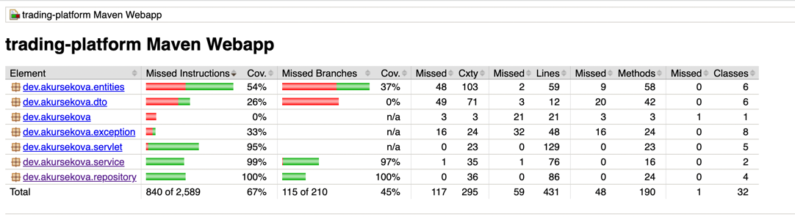
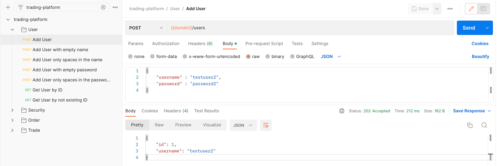

# trading-platform

## Introduction

This project is a trading platform, which consists of following entities:  

- Security: represents a tradable entity i.e. a stock
- User: users able to place sell/buy orders
- Order: an entity which reflects all details about requested entity to buy/sell
- Trade: entities in case of a matching between two or more orders 

## Run and Build the code using Docker  

- Install [Docker](https://docs.docker.com/install)
- Open the link https://github.com/akursekova/trading-platform/tree/dev and click Donwnload ZIP
- The name of downloaded folder will be trading-platform-dev, since it was downloaded from the dev branch
- run following commands
```
cd trading-platform-dev 
mvn clean install
docker build -t trading-platform-dev .
docker run -p 8080:8080 trading-platform-dev
```

## Test the code
```
mvn clean test
mvn jacoco:report
```

Test report will be generated by path: `trading-platform-dev/target/site/jacoco/index.html`

This is how JaCoCo report looks:  




## Test using Postman

There is a JSON collection in the root of the project.  
This collection was configured in Postman and can be used for testing purposes.

### Endpoint:
`http://localhost:8080/trading-platform`

### JSON collection:
There are 4 different folders: 
- `User`
- `Security`
- `Order`
- `Trade`

Each of these folders corresponds to main entities of trading platform.   
There is a set of GET/POST requests in each folder. 
All these requests cover both positive and negative scenarios.  
Importing Json Collection you will be able to test the platform from Postman.

### Example

On the picture below you can see the folder 'User' and all the requests inside the folder:
- `POST` request with empty username in order to check that system will not allow to create User object
- `POST` request with empty password in order to check that system will not allow to create User object
- `POST` request for successful User object creation
- `GET` request with userId existing in the system
- `GET` request with userId not existing in the system

In body section will be displayed the response in JSON format. 



## Structure of the project
This is a Maven project with standard Maven project structure:

`src/main/java` contains java classes  
`src/main/resources` resources used by application  
`src/test` — package to store tests
`pom.xml` is in the root of the project and contains all necessary dependencies for the correct work of the project.


In the root folder of the project `dev.akursekova` there are packages:

`dto`: responsible for data transportation in necessary format  
`entities`: contains classes of main entities of the trading platform  
`exception`: contains classes responsible for error handling  
`repository`: contains classes responsible for adding entities to the repositories  
`service`: this is the level between servlet and repository. Classes inside the service package are responsible for business logic  
`servlet`: package with servlets for each entity  

`TradingServletContextListener` - listener, which creates all service instances and places them in the servlet context.

There is a `web.xml` inside `WEB-INF`: it stores the information about configuration of the app.  
In current project it stores information about ExceptionHandlerServlet, which is responsible for error handling.

## Logging
In this project is used Log4j. Logger configuration is in xml format.  

Configuration is stored by path: `src/main/resources/log4j2.xml`.

Logs can be recorded to the file on your local computer.

_If this application will be run on your computer, please provide a path to the local folder on your computer for correct work of the application._

## Tests
This application is covered by tests. Tests are written using JUnit5 and Mockito.

In the package `dev.akursekova.servlet` are placed all servlet tests classes which cover functionality of all servlets.
Tests are checking both negative and positive scenarios for doGet/doPost methods. 

In the package `dev.akursekova.repository` are placed all classes responsible to check how and according to what rules entities created in the system.

In the package `dev.akursekova.service` are placed all classes responsible for intermediate logic between servlet level and repository level.